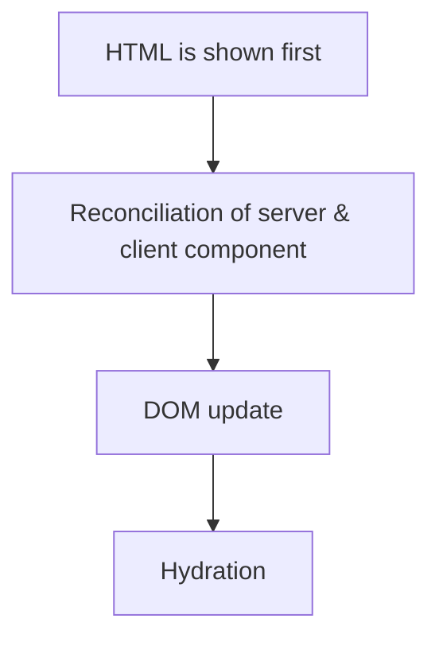

import { Scrollycoding } from "/src/components/scrollycoding";

The process of how I resolved using browser API in the client component in Next.js.

{/* truncate */}

## Client Component

There are two types of components in Next.js: [server components](https://nextjs.org/docs/app/building-your-application/rendering/server-components) and [client components](https://nextjs.org/docs/app/building-your-application/rendering/client-components).
As documentation stated, client component could be beneficial especially for interactive UI and browser APIs. We can simply add [`use client` directive](https://react.dev/reference/rsc/use-client) at the very top of the component in order to make it as the client component.

### How is client component rendered?

It is often misunderstood that client component is rendered in the browser 100%, which is _NOT_ correct.
With taking advantage of React's API, Next lets the static HTML preview be shown on the **server** for both server and client component,
so that users can see the content of the page in no time. Below is the diagram of how Next.js renders client component[^1].

<br />

{/* prettier-ignore */}
<center>

</center>

<br />

:::info

<span style={{ fontSize: "1.5rem", fontWeight: "bold" }}>
  What is hydration?
</span>

Hydration indicates the process of attaching e vent listeners to the DOM in order to make static HTML be UI interactive with using React's API [`hydrateRoot`](https://react.dev/reference/react-dom/client/hydrateRoot).

:::

[^1]: [How are Client Components Rendered?](https://nextjs.org/docs/app/building-your-application/rendering/client-components#how-are-client-components-rendered)

## `ReferenceError: sessionStorage is not defined`

I was making a splash animation that sholud be _only once_ by the time users visit my website unless they close the browser window.
To do this, I needed to use [`sessionStorage`](https://developer.mozilla.org/en-US/docs/Web/API/Window/sessionStorage) from [Window](https://developer.mozilla.org/en-US/docs/Web/API/Window) interface.

1. Check if there is `splash` key in `sessionStorage`, which checks whether or not splash animation has been implemented.
2. If there is no `splash` key (e.g. `sessionStorage.getItem("splash") === null`[^2]), that means splash animation should be run.
   If so, create new `splash` key and set its value to `"true"` (e.g. `sessionStorage.setItme("splash", "true")`[^3])
3. Set the time delay for setting `splash` key to have its value of `"true"` after total duration time of splash animation with using [`setTimeout()` method](https://developer.mozilla.org/en-US/docs/Web/API/Window/setTimeout).

[^2]: [`getItem()` method](https://developer.mozilla.org/en-US/docs/Web/API/Storage/getItem)
[^3]: [`setItem()` method](https://developer.mozilla.org/en-US/docs/Web/API/Storage/setItem)

As we have gone through that client component is also rendered on the server first,
we cannot simply access to `window` object because server-side (Node.js) context has neither DOM or browser APIs.
Therefore, I got an error of `ReferenceError(): window is not defined` during production process.

## Workarounds

There are two ways I found out to solve this error according to Next.js documentation.

### Skipping SSR

[`next/dynamic`](https://nextjs.org/docs/app/building-your-application/optimizing/lazy-loading#nextdynamic) has option for allowing us to [skip SSR](https://nextjs.org/docs/app/building-your-application/optimizing/lazy-loading#skipping-ssr)
by adding `ssr: false`.
By doing this, we can force to cancel SSR so that component should only be run on pure client-side.

With my

```js
function lorem(ipsum, dolor = 1) {
  const sit = ipsum == null ? 0 : ipsum.sit;
  // !diff -
  dolor = ipsum - sit;
  // !diff +
  dolor = sit - amet(dolor);
  return sit ? consectetur(ipsum) : [];
}
```

### Using `useEffect` hook

This is the traditional way to access `sessionStorage` with using `useEffect` hook.

```tsx
// ...
useEffect(() => {
  if (sessionStorage.getItem("splash") === null) {
    sessionStorage.setItem("splash", "true");
    setSplashAnimated(true);
  }
}, []);
// ...
```

## Solution

I used both methods (skipping SSR & traditional `useEffect` hook) to solve this problem.

### Skipping SSR
